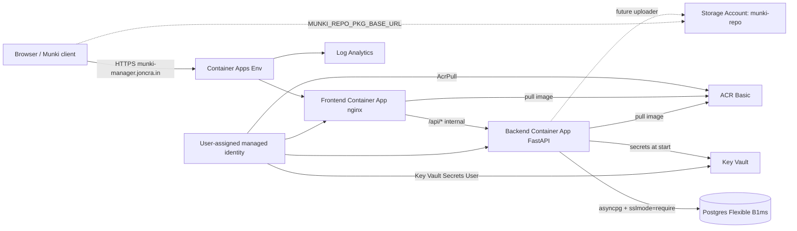

# Azure deployment

This guide walks through deploying Munki Manager to Microsoft Azure using the
Terraform configuration in [`terraform/`](../terraform/) and the helper targets
in the top-level [`Makefile`](../Makefile).

The target shape is intentionally minimal — one resource group, one
environment, no test/staging:

| Layer | Service | SKU |
|------|---------|-----|
| Compute | Azure Container Apps (backend + frontend) | Consumption, min 0 / max 3 |
| Database | Azure Database for PostgreSQL Flexible Server | `B_Standard_B1ms`, 32 GiB |
| Registry | Azure Container Registry | Basic |
| Secrets | Azure Key Vault + Container Apps Key Vault references | Standard |
| Package storage | Azure Storage Account, public-read blob container `munki-repo` | Standard LRS |
| Logs | Log Analytics workspace | PerGB2018, 30-day retention |
| TLS | Container Apps managed certificate | Free |
| Identity | One user-assigned managed identity for both apps | — |

Rough monthly cost at idle: **$20–35** (Container Apps scales to zero, Postgres
is the floor at ~$13–18, ACR is $5, everything else is rounding).

## Prerequisites

```sh
# macOS, via Homebrew
brew install azure-cli terraform
az login                                   # open the browser, pick the right tenant
az account set --subscription "<sub-name>" # if you have more than one
```

You'll also need:

- A GitHub PAT (only if you want the AutoPkg GitHub Actions runner; can be empty)
- Cloudflare DNS access for the zone you're putting `munki-manager.<your-domain>` under
- A 32-byte hex string for the JWT signing secret (`openssl rand -hex 32`)
- A 32-byte hex string for the local AutoPkg runner token (`openssl rand -hex 32`), if you plan to use local runners
- A strong Postgres admin password (16+ characters; the Flexible Server validator rejects weak ones)

## 1. Configure Terraform variables

```sh
cd terraform
cp terraform.tfvars.example terraform.tfvars
$EDITOR terraform.tfvars
```

Required values:

```hcl
postgres_admin_password = "<strong password>"
app_secret_key          = "<openssl rand -hex 32>"
custom_domain           = "munki-manager.example.com"  # whatever hostname you want
```

Optional but typical:

```hcl
github_token       = "ghp_..."
github_repo        = "your-org/munki-recipes"
local_runner_token = "<openssl rand -hex 32>"

# Admin AI Insights (Gemini). Key from https://aistudio.google.com/apikey
gemini_api_key   = "AIza..."
insights_enabled = true
# gemini_model   = "gemini-3.1-flash-lite-preview"  # optional override
```

The `terraform.tfvars` file is gitignored — do not commit it.

### Picking a `gemini_api_key`

Admin AI Insights reads fleet/Munki data via Gemini tool calling. Create an API
key at <https://aistudio.google.com/apikey>, set `gemini_api_key` and
`insights_enabled = true` in `terraform.tfvars`, then `make tf-apply`.

Like other app secrets, the Key Vault value is owned by Terraform — rotate by
editing `terraform.tfvars`, not with `az keyvault secret set` alone.

### Picking a `github_token`

Munki Manager hits two distinct sets of GitHub repos with this token:

1. **Your own munki-recipes repo** — to dispatch the AutoPkg cloud-runner
   workflow (`POST /repos/{owner}/{repo}/actions/workflows/{file}/dispatches`).
2. **The public `autopkg/*` org and other recipe-author repos** — to read
   recipe contents for trust verification.

The simplest token that covers both is a **classic PAT** with these scopes:

- `public_repo` (read public repo contents — covers `autopkg/*` and any
  other public recipe sources)
- `workflow` (dispatch your own workflow)
- `repo` instead of `public_repo` if your `github_repo` is **private**

Generate it at <https://github.com/settings/tokens> → "Generate new token
(classic)". Set "Expiration" to whatever your security policy allows; the
token is stored in Key Vault and only the backend container ever reads it.

> **Heads up:** the value of the `github-token` Key Vault secret is owned
> by Terraform (`terraform/keyvault.tf`). If you rotate the PAT with
> `az keyvault secret set` directly, the next `terraform apply` will
> silently overwrite it with whatever is still in `terraform.tfvars`. Always
> rotate by editing `terraform.tfvars` and running `make tf-apply`.

A **fine-grained PAT** also works for the dispatch half (Contents: Read,
Actions: Read & write on your repo) but **the `autopkg` organization
forbids fine-grained PATs whose lifetime is greater than 366 days** —
anything longer returns HTTP 403 with a clear policy message and the
trust-verification calls to `autopkg/*` will fail. If you want fine-grained,
keep the lifetime ≤ 366 days and grant "Public Repositories: Read-only"
so the token can read `autopkg/*` and other recipe-author repos.

## 2. Bootstrap apply (everything except the custom domain)

```sh
make tf-init
make tf-apply
```

This creates:

- Resource group `rg-munkimanager`
- ACR `acrmunkimanager<suffix>`
- Key Vault `kv-munkimanager-<suffix>` with all the app secrets
- Postgres Flexible Server `psql-munkimanager-<suffix>` + database `automunki`
- Storage Account `stmunkimanager<suffix>` + `munki-repo` container (public blob read)
- Container Apps environment `cae-munkimanager`
- Two Container Apps (`ca-munkimanager-backend`, `ca-munkimanager-frontend`)
- Log Analytics workspace `log-munkimanager`

The first apply takes ~5–8 minutes (Postgres is the long pole). At the end you
get an output that looks like:

```
next_steps = "FIRST APPLY DONE. Next: (1) build & push images via `make deploy`. (2) In Cloudflare, create CNAME 'munki-manager.example.com' -> 'ca-munkimanager-frontend.<env>.<region>.azurecontainerapps.io' (DNS only / gray cloud). (3) Re-run `terraform apply -var enable_custom_domain=true`."
```

The Container Apps come up pointing at a public Microsoft "hello world" image
(`mcr.microsoft.com/azuredocs/containerapps-helloworld`) so the revision
creates successfully even though ACR is still empty. The hello-world container
listens on port 80, while the Munki Manager apps want 8000 (backend) and 3000
(frontend) — so the bootstrap revision will show as **unhealthy** in the
portal until you run `make deploy` and real images take over. That's expected;
the next step fixes it.

## 3. Build and push the images

```sh
cd ..   # back to repo root
make deploy
```

This runs server-side builds in ACR (no local Docker required) and rolls both
Container Apps to the new tag (defaults to the short git SHA). Subsequent code
changes can be deployed with the same one-liner.

After this, the app is reachable at the auto-generated URL:

```sh
make tf-output | grep frontend_default_url
# https://ca-munkimanager-frontend.<env>.<region>.azurecontainerapps.io
```

Open that URL — you should see the Munki Manager UI. Migrations run
automatically every time the backend container starts (see
`backend/entrypoint.sh`), so the first deploy already creates the schema and
subsequent `make deploy`s pick up new revisions without a separate step.

If you need to run migrations manually (e.g. an out-of-band fix on a
container that has `RUN_MIGRATIONS_ON_START=false`):

```sh
make migrate
```

## 4. Custom domain via Cloudflare

Munki Manager works on the auto-generated URL forever, but Munki clients will
have whatever hostname you enroll them with baked into their `.mobileconfig`,
so it's worth doing this once up front.

### a. Get the CNAME target

```sh
make show-cname
# Cloudflare DNS: CNAME munki-manager.example.com -> ca-munkimanager-frontend.<env>.<region>.azurecontainerapps.io (Proxy: DNS only / gray cloud)
```

### b. Create the CNAME in Cloudflare

In the Cloudflare dashboard:

1. **DNS → Records → Add record**
2. **Type**: CNAME
3. **Name**: `munki-manager` (or whatever subdomain you chose)
4. **Target**: the FQDN from the previous step
5. **Proxy status**: **DNS only** (gray cloud) — *required* during cert validation
6. **TTL**: Auto

> **Why gray cloud?** Container Apps' managed-cert validator does an HTTP request
> to `<custom-domain>` and expects to reach the Container Apps Front Door. If
> Cloudflare's proxy (orange cloud) is in the path, Cloudflare answers first
> and validation never reaches Azure. Once the cert issues, you *can* flip to
> orange cloud, but read [the proxy caveat](#cloudflare-orange-cloud-and-munki-clients) first.

Wait ~30 seconds for the record to propagate, then verify:

```sh
dig +short CNAME munki-manager.example.com
# ca-munkimanager-frontend.<env>.<region>.azurecontainerapps.io
```

### c. Get the asuid validation token + create the TXT record

Container Apps requires a TXT record under `asuid.<your-domain>` to prove
domain ownership before it will bind the hostname. Find the token by
attempting to bind the hostname — `az` will tell you what TXT to add:

```sh
az containerapp hostname add \
  --resource-group rg-munkimanager \
  --name ca-munkimanager-frontend \
  --hostname munki-manager.example.com
# ERROR: A TXT record pointing from asuid.munki-manager.example.com to
# 17718D732C5F4084AF0374CAC418DC0C5511EFC6E59A16C1E7383A14EF2F1166 was not found.
```

Copy that hex token into Cloudflare:

1. **DNS → Records → Add record**
2. **Type**: TXT
3. **Name**: `asuid.munki-manager` (Cloudflare appends the zone)
4. **Content**: the hex token from the error above
5. **Proxy status**: DNS only (TXT records can't be proxied anyway)
6. **TTL**: Auto

Wait ~30 seconds, then verify:

```sh
dig +short TXT asuid.munki-manager.example.com
# "17718D732C5F4084AF0374CAC418DC0C5511EFC6E59A16C1E7383A14EF2F1166"
```

### d. Bind the hostname + issue the cert

```sh
make tf-domain CUSTOM_DOMAIN=munki-manager.example.com
```

This runs three `az` commands in sequence:

1. `az containerapp hostname add` — binds the hostname (now succeeds because
   the TXT exists)
2. `az containerapp env certificate create --validation-method CNAME` — issues
   the free managed certificate (validated against the CNAME you set in step b)
3. `az containerapp hostname bind` — wires the cert to the bound hostname so
   TLS terminates correctly

Cert issuance takes 1–5 minutes. Watch:

```sh
az containerapp env certificate list \
  --resource-group rg-munkimanager \
  --name $(terraform -chdir=terraform output -raw container_app_environment_name) \
  -o table
```

Once the status reads `Succeeded`, the app is reachable at
`https://munki-manager.example.com`.

> **Why isn't this in Terraform?** The `azurerm` provider's
> `azurerm_container_app_environment_managed_certificate` resource fails
> with `RequireCustomHostnameInEnvironment` when applied before the
> hostname is bound, but `azurerm_container_app_custom_domain` requires a
> cert ID to bind. The chicken-and-egg makes a single `terraform apply`
> impossible. We deliberately moved this to the Makefile / `az` CLI rather
> than maintain a brittle two-apply Terraform dance.

## 5. Create the first admin user

```sh
open "https://munki-manager.example.com"
```

Register the first account through the UI (`AUTH_REGISTRATION_OPEN=true` is the
default). The first account gets the seeded **Viewer** role, which cannot
open `/admin/access` — promote it to a superuser via SQL (matches the path
documented in [users-and-auth.md](users-and-auth.md#first-operator--admin-access)):

```sh
make psql
# inside psql:
UPDATE "user" SET is_superuser = true WHERE email = 'you@example.com';
\q
```

Refresh the browser — `/admin/access` is now reachable and you can assign the
**Administrator** role to other accounts from the UI.

Then close registration:

```sh
az containerapp update \
  -g rg-munkimanager -n ca-munkimanager-backend \
  --set-env-vars AUTH_REGISTRATION_OPEN=false
```

(Or set this in `containerapps.tf` and re-apply — but a one-shot `update` is
quicker.)

## Day-2 operations

| Task | Command |
|------|---------|
| Ship a code change (local) | `make deploy` |
| Ship a code change (CI)    | GitHub Actions → **Deploy to Azure** workflow (`workflow_dispatch`), or push to `main` |
| Run migrations | Automatic on every backend container start (`backend/entrypoint.sh`); use `make migrate` only for ad-hoc fixups |
| Tail backend logs | `make logs-backend` |
| Tail frontend logs | `make logs-frontend` |
| Open psql against prod | `make psql` |
| Rotate a secret | Edit the corresponding variable in `terraform/terraform.tfvars` (e.g. `app_secret_key`, `github_token`, `gemini_api_key`, `postgres_admin_password`, `local_runner_token`), then `make tf-apply` to push it into Key Vault, then **force a new backend revision** with `az containerapp update -g rg-munkimanager -n ca-munkimanager-backend --revision-suffix kvref$(date +%s)`. A plain `az containerapp revision restart` does **not** re-resolve Key Vault references — Container Apps only re-fetches them when a new revision is created, so a restart leaves the old secret value in the container's env. Direct `az keyvault secret set` writes get overwritten the next time anyone runs `terraform apply` because `terraform/keyvault.tf` owns the secret value. |
| Rotate the GitHub PAT | Update `github_token` in `terraform.tfvars` to the new classic PAT, `make tf-apply`, then force a new backend revision (command above). Sanity-check the budget with `curl -H "Authorization: Bearer $TOK" https://api.github.com/rate_limit` — `core.limit` should be 5000 (authenticated). For a classic PAT also confirm it can read `autopkg/*`: `curl -s -o /dev/null -w "%{http_code}\n" -H "Authorization: Bearer $TOK" https://api.github.com/repos/autopkg/recipes` should return `200`. |
| Tear it all down | `make tf-destroy` |

## GitHub Actions deploy

[`.github/workflows/deploy.yml`](../.github/workflows/deploy.yml) is the CI
counterpart of `make deploy`. It runs `az acr build` server-side for both
images, rolls both Container Apps to the new tag, and waits for the backend
revision to report `Healthy`. Migrations run inside the backend container on
start (`backend/entrypoint.sh` calls `alembic upgrade head` before exec'ing
uvicorn), so there's no separate migration step in the workflow.

Triggers:

- **`workflow_dispatch`** — manual run from the Actions tab. Inputs:
  - `tag` (default: short git SHA)
  - `services` (`both` / `backend` / `frontend`)
- **`push` to `main`** with changes under `backend/`, `frontend/`, or
  `.github/workflows/deploy.yml`. Always rolls both apps and runs migrations.

### One-time bootstrap: federated credentials (OIDC)

The workflow logs into Azure with **OIDC federated credentials** — no client
secret is stored in GitHub.

```sh
RG=rg-munkimanager
SUB_ID=$(az account show --query id -o tsv)
TENANT_ID=$(az account show --query tenantId -o tsv)
REPO=joncrain/munki-manager   # owner/repo

# 1. App registration + service principal.
APP_ID=$(az ad app create --display-name "munki-manager-deploy" --query appId -o tsv)
az ad sp create --id "$APP_ID" >/dev/null
SP_OBJECT_ID=$(az ad sp show --id "$APP_ID" --query id -o tsv)

# 2. Federated credentials: one for workflow_dispatch + push to main, one for PRs (optional).
az ad app federated-credential create --id "$APP_ID" --parameters @- <<JSON
{
  "name": "github-main",
  "issuer": "https://token.actions.githubusercontent.com",
  "subject": "repo:${REPO}:ref:refs/heads/main",
  "audiences": ["api://AzureADTokenExchange"]
}
JSON

# 3. Roles. AcrPush + Contributor on the RG covers `az acr build`,
#    `az containerapp update`, and `az containerapp exec`.
ACR_ID=$(az acr list -g "$RG" --query "[0].id" -o tsv)
RG_ID=$(az group show -n "$RG" --query id -o tsv)
az role assignment create --assignee-object-id "$SP_OBJECT_ID" \
  --assignee-principal-type ServicePrincipal --role AcrPush --scope "$ACR_ID"
az role assignment create --assignee-object-id "$SP_OBJECT_ID" \
  --assignee-principal-type ServicePrincipal --role Contributor --scope "$RG_ID"

# 4. Print the values to set as GitHub Actions secrets.
echo
echo "Set these in GitHub → Settings → Secrets and variables → Actions → Secrets:"
echo "  AZURE_CLIENT_ID         $APP_ID"
echo "  AZURE_TENANT_ID         $TENANT_ID"
echo "  AZURE_SUBSCRIPTION_ID   $SUB_ID"
echo "  AZURE_RESOURCE_GROUP    $RG"
```

OIDC federated tokens are scoped to the exact `subject` claim
(`repo:OWNER/REPO:ref:refs/heads/main`), so revealing the
client/tenant/subscription IDs alone doesn't grant access on its own — but
storing them as **Secrets** rather than Variables keeps them out of public
workflow logs and is the safer default for a public repo.

If you want PR/preview deploys, add a second federated credential with subject
`repo:OWNER/REPO:pull_request` and gate the workflow with
`if: github.event.pull_request.head.repo.full_name == github.repository`.

### Running the workflow

```sh
gh workflow run deploy.yml                          # dispatch with all defaults
gh workflow run deploy.yml -f services=backend      # only the backend (e.g. config-only fix)
gh workflow run deploy.yml -f services=frontend     # only the frontend (skip backend roll & on-start migration)
```

Or push a code change to `main` and watch the workflow auto-trigger from the
Actions tab.

### Why `Contributor` on the RG and not something narrower

- `AcrPush` covers `az acr build`.
- `az containerapp update` requires either `Contributor` on the resource group
  or the more granular `Container Apps Contributor` role. Either works for
  the deploy workflow now that migrations run on container start (no
  `az containerapp exec` from CI).

Container Apps resolves Key Vault references **only when a revision is
created**, not on plain `revision restart`. A restarted replica reuses the
secret values it captured at boot. To pick up a new Key Vault secret value,
create a new revision (the rotate row above uses `--revision-suffix` for a
no-image-change revision bump).

## Cost knobs

The defaults are tuned for "demo / personal." To trim further:

- `backend_min_replicas = 0`, `backend_max_replicas = 1` — drops the always-on
  replica (saves a few $/mo) at the cost of a 5-15s cold start on the first
  request after idle. The frontend already defaults to scale-to-zero.
- Use `az containerapp env workload-profile` to leave the consumption plan if
  you don't already
- Turn off the Container App entirely between use:
  `az containerapp update --min-replicas 0 --max-replicas 0`
  (keeps the resource, charges nothing for compute, restart with `--max-replicas 1`)
- For Postgres, consider `az postgres flexible-server stop` when not in use —
  the storage charge continues but compute stops

To scale up for real load:

- `postgres_sku = "B_Standard_B2s"` (2 vCPU / 4 GiB)
- `backend_min_replicas = 1` (the default) to avoid cold starts on the first
  request after idle
- `backend_cpu = 1`, `backend_memory = "2Gi"` for heavier AutoPkg ingest workloads

## Cloudflare orange cloud and Munki clients

Once the managed cert has issued you *can* flip the CNAME's proxy back to
orange cloud, but two gotchas:

1. **Munki client downloads.** The `postflight` agent and `managedsoftwareupdate`
   POST and GET against your origin. Cloudflare Free's WAF and bot-management
   defaults will sometimes 403 these requests. If you see 4xx in
   `make logs-backend` from clients, either keep the proxy off for the
   `munki-manager` subdomain or add a Cloudflare WAF rule allowing the Munki
   user agents.
2. **Munki client TLS pinning.** None of Munki's tooling pins certs, but
   `MUNKI_REPO_PKG_BASE_URL` points at `<storage>.blob.core.windows.net`
   directly (not through Cloudflare), so package downloads bypass Cloudflare
   regardless. Only the API/UI traffic goes through the proxy.

For a demo, gray cloud everywhere is the safest default.

## Troubleshooting

### "Custom domain validation failed"

The CNAME isn't yet visible to Azure. Verify with `dig +short CNAME` *and*
make sure proxy is gray. Sometimes Azure caches the negative validation for
~5 minutes; retry `make tf-domain` after that.

### `make tf-domain` errors with `CertificateProvisioningError ... is not in succeeded provisioning state`

Managed-cert issuance is asynchronous. The newer `make tf-domain` polls for
`Succeeded` automatically, but if you ran an older version (or `az` directly)
and it failed at the bind step, the cert is most likely still issuing in the
background. Re-run `make tf-domain CUSTOM_DOMAIN=...` — it's idempotent: it
will skip the hostname-add and cert-create (since they already exist), wait
for the cert to flip to `Succeeded`, and then bind it.

Watch the cert status manually:

```sh
az containerapp env certificate list -g rg-<prefix> --name cae-<prefix> \
  --query '[].{name:name, subject:properties.subjectName, state:properties.provisioningState}' -o table
```

### `terraform apply` fails with `KeyBasedAuthenticationNotPermitted` on the storage account

```
Error: encoding Storage Account ... retrieving queue properties for Storage
Account ...: executing request: unexpected status 403 (403 Key based
authentication is not permitted on this storage account.) with
KeyBasedAuthenticationNotPermitted
```

This is the bootstrap chicken-and-egg around the storage hardening (see
`terraform/storage.tf`):

- `shared_access_key_enabled = false` on the storage account disables shared
  keys for everyone, including Terraform's own state-refresh reads.
- `provider.storage_use_azuread = true` switches those reads to AAD.
- The operator's AAD identity needs **Storage Blob Data Owner**, **Storage
  Queue Data Contributor**, **Storage Table Data Contributor**, and
  **Storage File Data Privileged Contributor** on the resource group.

On a fresh deploy this all happens automatically — the `azurerm_storage_account.repo`
resource has `depends_on` set so the four `azurerm_role_assignment.operator_storage_*`
resources land first. But if you previously applied with shared keys enabled
and then enabled the hardening, the failing refresh happens *before* terraform
gets a chance to create the role assignments. Recover by targeting just the
role assignments, then re-running the full apply:

```sh
cd terraform
terraform apply \
  -target=azurerm_role_assignment.operator_storage_blob_owner \
  -target=azurerm_role_assignment.operator_storage_queue \
  -target=azurerm_role_assignment.operator_storage_table \
  -target=azurerm_role_assignment.operator_storage_file
cd ..
make tf-apply
```

If you set `var.operator_ip_allowlist`, also make sure your current public
IP is listed — once `azurerm_storage_account_network_rules.repo` lands, any
IP not on the list (including yours, if it changed) will start getting 403s
on subsequent state refreshes.

### Container Apps stuck on `ProvisioningFailed`

Most common causes:

- **`MANIFEST_UNKNOWN: manifest tagged by "..." is not found`** — the image tag
  in `var.backend_image_tag` / `var.frontend_image_tag` doesn't exist in ACR.
  If you're applying after a `tf-destroy` and never ran `make deploy`, set the
  vars back to `""` (empty) to use the bootstrap hello-world image, or run
  `make build` first to populate ACR.
- **Image pulled but container fails to start** — check
  `az containerapp logs show -g <rg> -n <app> --tail 200` (or
  `make logs-backend` / `make logs-frontend`). For the backend, the most common
  cause is wrong `DATABASE_URL` or a missing migration; for the frontend, a
  Vite build failure during `az acr build`.
- **Probe failures** — bootstrap revisions point at the hello-world image which
  listens on port 80; the probes target 8000/3000 so the bootstrap revision
  will always show unhealthy until `make deploy` runs.

### `Postgres password validation failed`

Flexible Server requires 8+ chars including 3 of {upper, lower, digit, symbol}
and disallows the username as a substring. Pick something else.

### Key Vault secret read fails from the Container App

Check that the user-assigned managed identity has the **Key Vault Secrets User**
role on the vault: `az role assignment list --scope $(az keyvault show -n <kv> --query id -o tsv)`.
The Terraform sets this up but a manual `tf-destroy` of just the role can
strand the apps.

### Migrations fail with "connection refused"

The Postgres firewall rule `AllowAllAzureServices` (start=0.0.0.0, end=0.0.0.0)
is the magic "allow Azure" rule — verify it exists with
`az postgres flexible-server firewall-rule list`. If you wiped it, re-apply.

### Frontend → backend traffic returns "This Container App is stopped or does not exist" (404)

This is a Container Apps **internal ingress** quirk. The backend's `external_enabled = false`
ingress sometimes refuses to route cross-app traffic from the frontend even
when the backend revision is healthy and replicas are running. The Terraform
deliberately works around this by setting the backend's `external_enabled = true`
with `allow_insecure_connections = true` — the JWT auth middleware on every
`/api/v1/*` route is what protects the backend, not network isolation.

If you want defense in depth, add an `ip_security_restriction` block to the
backend ingress allowing only the Container Apps environment's static IP
(see `az containerapp env show --query 'properties.staticIp'`).

### Frontend → backend traffic returns 301 in an infinite redirect loop

If you see the frontend's nginx returning `HTTP 301` with `Location:` pointing
at *itself*, the cause is `proxy_set_header Host $host;` in `nginx.conf.template`.
That sends the **frontend's** hostname to the backend's ingress LB, which then
redirects to "the right" hostname, which the frontend rewrites back to itself.

The fix: don't set `Host` explicitly — let nginx default to the upstream
hostname from `proxy_pass`. The `frontend/nginx.conf.template` in this repo
already does the right thing.

### Container Apps doesn't pick up the new image after `make deploy`

If you push a new image with the same tag (e.g. `e8683fa` because git SHA
hasn't changed), `az containerapp update --image …:tag` may keep the old
revision because the digest hasn't apparently changed in its eyes. Force a
new revision by pinning to the digest:

```bash
DIGEST=$(az acr repository show -n <acr> --image munki-manager-frontend:latest --query digest -o tsv)
az containerapp update -g <rg> -n ca-<prefix>-frontend \
  --image "<acr>.azurecr.io/munki-manager-frontend@${DIGEST}"
```

Or just commit something so the git SHA changes and the tag is fresh.

### Healthy revision but the LB serves the bootstrap "hello-world" image

The `_:bootstrap` placeholder revision can stay `Active` alongside the real
one if `make tf-apply` and `make deploy` are interleaved oddly. Single-revision
mode usually deactivates the older one, but not always. Force it:

```bash
az containerapp revision list -g <rg> -n <app> -o table
az containerapp revision deactivate -g <rg> -n <app> --revision <bootstrap-rev>
```

## What the Terraform creates, in one diagram



## Future work

- See [`storage-backends.md`](storage-backends.md) for swapping Azure Blob with
  AWS S3+CloudFront or Mac mini nginx.
- For private Postgres (no public IP, VNet-integrated Container Apps), see the
  Microsoft docs for [Container Apps VNet integration](https://learn.microsoft.com/en-us/azure/container-apps/networking)
  + [Postgres Flexible Server private access](https://learn.microsoft.com/en-us/azure/postgresql/flexible-server/concepts-networking-private). Adds ~$5–10/mo for the
  Private Endpoint and is overkill for a demo.
